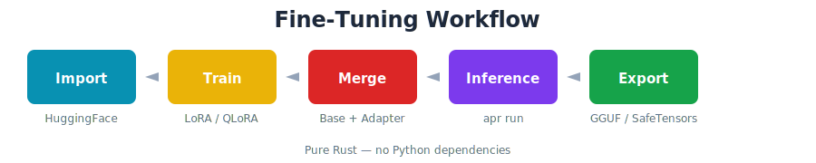

<div align="center">

<p align="center">
  
</p>

<h1 align="center">HF-Advanced-Fine-Tuning</h1>

<p align="center">
  <b>Course 4: Advanced Fine-Tuning with Sovereign AI Stack</b>
</p>

<p align="center">
  <a href="https://github.com/paiml/HF-Advanced-Fine-Tuning/actions/workflows/ci.yml"></a>
  <a href="https://huggingface.co/Qwen/Qwen2.5-Coder-1.5B-Instruct"></a>
  <a href="https://crates.io/crates/apr-cli"></a>
  <a href="https://opensource.org/licenses/MIT"></a>
</p>

</div>

---

Fine-tune Qwen2.5-Coder models using the **Sovereign AI Stack** — pure Rust tools for privacy-preserving ML with no Python dependencies.

## Quick Start

```bash
# Clone repository
git clone https://github.com/paiml/HF-Advanced-Fine-Tuning.git
cd HF-Advanced-Fine-Tuning

# Install Sovereign AI Stack tools
cargo install entrenar realizar apr-cli

# Import model from HuggingFace
apr import hf://Qwen/Qwen2.5-Coder-1.5B-Instruct -o base.apr

# Fine-tune with LoRA
entrenar train --model base.apr --config labs/qwen2.5-coder-1.5b-finetune.yaml -o adapter.apr

# Merge adapter with base model
apr merge base.apr adapter.apr --strategy lora -o merged.apr

# Run inference
apr run merged.apr --prompt "/// Parses command-line arguments"
```

## Course Structure

**3 Weeks × 3 Lessons = 9 Lessons (26 Videos)**

| Week | Module | Focus |
|------|--------|-------|
| 1 | ML Foundations & Compute | Data shapes, hardware mapping, transformer architecture |
| 2 | Transformer Internals & LoRA | Tokenization, attention, FFN, LoRA fundamentals |
| 3 | QLoRA & Corpus Engineering | Quantization, corpus creation, HuggingFace publishing |
| 4 | Final Project Challenge | Enhance the Qwen fine-tuning pipeline in entrenar |

See [docs/outline.md](docs/outline.md) for complete course outline.

## Interactive Demos

### Week 1: Transformer Foundations

| Demo | Command | Purpose |
|------|---------|---------|
| Scalar vs SIMD vs GPU | `make demo-scalar-simd-gpu` | When GPU wins vs loses |
| Training vs Inference | `make demo-training-vs-inference` | Parallel vs sequential bottlenecks |
| Inference Pipeline | `make demo-inference-pipeline` | 6-step token flow |
| BPE vs Word | `make demo-bpe-vs-word` | Subword tokenization |
| Attention | `make demo-attention` | QKV and softmax |
| Feed-Forward | `make demo-feed-forward` | Expand → GELU → Contract |

### Week 2: LoRA & Fine-Tuning

| Demo | Command | Purpose |
|------|---------|---------|
| Full Fine-Tune Cost | `make demo-full-finetune-cost` | Why 7B needs 60GB+ |
| LoRA Math | `make demo-lora-math` | W' = W + A×B decomposition |
| QLoRA | `make demo-qlora` | 4-bit quantization + LoRA |
| Rank Ablation | `make demo-lora-rank-ablation` | r=4,8,16,32,64 trade-offs |
| LoRA Merge | `make demo-lora-merge` | Merge adapter to base |

## Model Tiers

| Tier | Model | VRAM | Use Case |
|------|-------|------|----------|
| Tiny | Qwen2.5-Coder-0.5B | ~2GB | Quick iteration, CI testing |
| **Small** | Qwen2.5-Coder-1.5B | ~4GB | **Colab free tier (T4 16GB)** |
| Medium | Qwen2.5-Coder-7B | ~8GB | Production fine-tuning |
| Large | Qwen2.5-Coder-32B | ~20GB | Full capability |

## Sovereign AI Stack

```
┌─────────────────────────────────────────────────────────┐
│                    Course Tools                          │
├─────────────────────────────────────────────────────────┤
│  entrenar     │  realizar     │  apr-cli    │ alimentar │
│  (Training)   │  (Inference)  │  (CLI)      │  (Data)   │
├─────────────────────────────────────────────────────────┤
│              aprender (ML Library)                       │
├─────────────────────────────────────────────────────────┤
│              trueno (SIMD/GPU Compute)                   │
└─────────────────────────────────────────────────────────┘
```

| Crate | Purpose | Link |
|-------|---------|------|
| **trueno** | SIMD/GPU tensor operations | [crates.io](https://crates.io/crates/trueno) |
| **aprender** | ML library, HuggingFace Hub | [crates.io](https://crates.io/crates/aprender) |
| **entrenar** | Training: autograd, LoRA/QLoRA | [crates.io](https://crates.io/crates/entrenar) |
| **realizar** | Inference engine (GGUF, SafeTensors) | [crates.io](https://crates.io/crates/realizar) |
| **alimentar** | Data pipelines, corpus management | [crates.io](https://crates.io/crates/alimentar) |
| **apr-cli** | CLI: import, export, merge, serve | [crates.io](https://crates.io/crates/apr-cli) |

## Corpus Project

Build training datasets from Rust CLI documentation:

```bash
cd corpus

# Clone source repositories (ripgrep, clap, bat, etc.)
cargo run --release -- clone-sources

# Extract function signatures + doc comments via AST
cargo run --release -- extract

# Run 100-point Popperian falsification suite
cargo run --release -- falsify

# Publish to HuggingFace Hub
cargo run --release -- publish
```

## Documentation

| Document | Description |
|----------|-------------|
| [Course Outline](docs/outline.md) | 3-week curriculum with learning objectives |
| [Introduction & Resources](docs/course-introduction-resources.md) | GitHub repos, crates, reference papers |
| [Final Project Challenge](docs/final-project-challenge.md) | Capstone: enhance entrenar fine-tuning |

## Labs

| Week | Lab | Description |
|------|-----|-------------|
| 1 | `lab-transformer-trace` | Trace token through full pipeline |
| 1 | `lab-attention-viz` | Visualize attention weights |
| 2 | `lab-lora-cli-help` | LoRA fine-tune on CLI help task |
| 2 | `lab-qlora-cli-help` | QLoRA 4-bit on CLI help task |
| 2 | `lab-rank-ablation` | Compare r=4,8,16,32 |
| 3 | `lab-corpus-creation` | Build custom training corpus |

## Prerequisites

- **Rust 1.75+** — `rustup update stable`
- **4GB+ VRAM** — GTX 1070 minimum, RTX 3060+ recommended
- **CUDA 12.0+** — Optional, for GPU acceleration

## Development

```bash
# Build all demos
make build

# Run all quality checks
make check

# Lint
make lint
```

## Published Model

```bash
# Download and run the fine-tuned model
apr pull paiml/rust-cli-docs-qwen
apr run paiml/rust-cli-docs-qwen --prompt "How do I use clap for CLI arguments?"
```

| Model | Format | Description |
|-------|--------|-------------|
| [paiml/rust-cli-docs-qwen](https://huggingface.co/paiml/rust-cli-docs-qwen) | `.apr` | Qwen2 fine-tuned on Rust CLI docs |

## License

MIT License — see [LICENSE](LICENSE) for details.

---

<p align="center">
  <sub>Built by <a href="https://paiml.com">Pragmatic AI Labs</a> — Sovereign AI for Everyone</sub>
</p>
